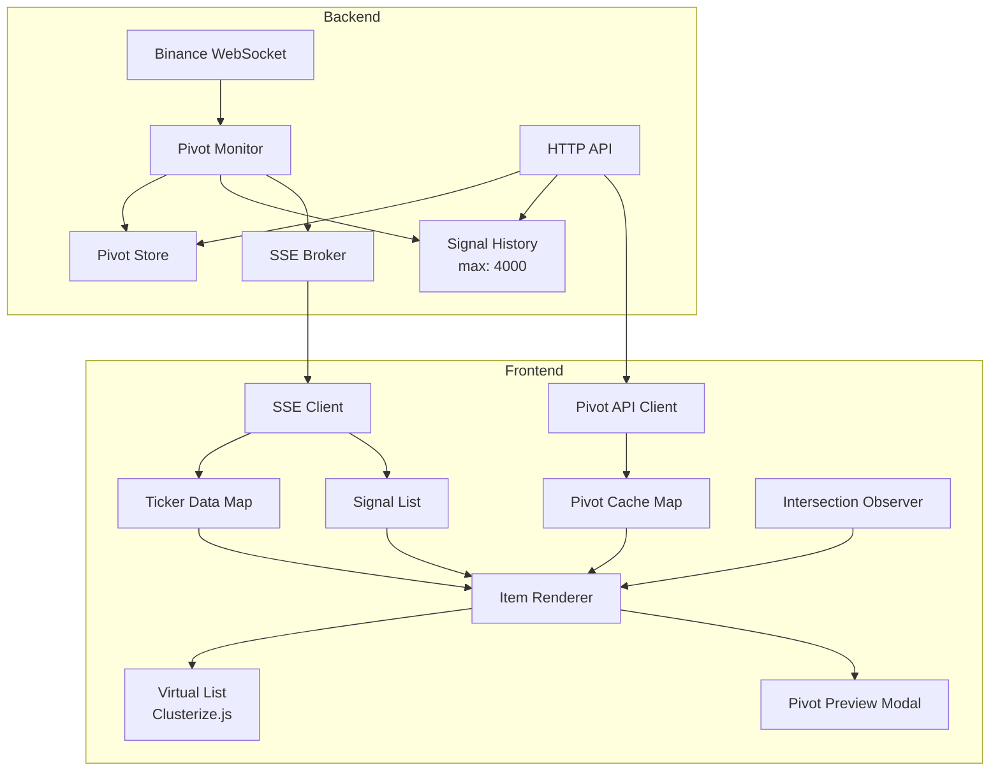

# Design Document: Pivot Enhancements

## Overview

本设计文档描述了 Binance Pivot Monitor 的功能增强，包括全点位触发推送、信号存储扩容、枢轴点 API、前端枢轴点渲染和预览功能。设计重点关注性能优化、数据一致性和实时联动。

## Architecture

### 系统架构图



### 数据流

1. **价格更新流**: Binance WS → Monitor → checkAllLevels → emit → History + SSE
2. **枢轴点查询流**: Frontend → API → PivotStore → Response → PivotCache
3. **实时渲染流**: SSE ticker → TickerData → IntersectionObserver → Visible Items → DOM Update

## Components and Interfaces

### 1. Monitor 组件增强

```go
// internal/monitor/monitor.go

// checkPeriod 检查所有枢轴点位（扩展到全部 11 个点位）
func (m *Monitor) checkPeriod(symbol string, period pivot.Period, prev, price float64, ts time.Time) {
    lv, ok := m.PivotStore.GetLevels(period, symbol)
    if !ok {
        return
    }

    // 检查所有点位（新增 PP, R1, R2, S1, S2）
    m.checkLevel(symbol, period, "PP", lv.PP, prev, price, ts)
    m.checkLevel(symbol, period, "R1", lv.R1, prev, price, ts)
    m.checkLevel(symbol, period, "R2", lv.R2, prev, price, ts)
    m.checkLevel(symbol, period, "R3", lv.R3, prev, price, ts)
    m.checkLevel(symbol, period, "R4", lv.R4, prev, price, ts)
    m.checkLevel(symbol, period, "R5", lv.R5, prev, price, ts)
    m.checkLevel(symbol, period, "S1", lv.S1, prev, price, ts)
    m.checkLevel(symbol, period, "S2", lv.S2, prev, price, ts)
    m.checkLevel(symbol, period, "S3", lv.S3, prev, price, ts)
    m.checkLevel(symbol, period, "S4", lv.S4, prev, price, ts)
    m.checkLevel(symbol, period, "S5", lv.S5, prev, price, ts)
}

// checkLevel 检查单个点位（修复价格跳跃问题）
// 当价格从 prev 变化到 price 时，检查是否穿越了 levelPrice
func (m *Monitor) checkLevel(symbol string, period pivot.Period, levelName string, levelPrice float64, prev, price float64, ts time.Time) {
    if levelPrice <= 0 {
        return
    }

    // 向上穿越：prev < levelPrice <= price
    if prev < levelPrice && price >= levelPrice {
        m.emit(symbol, period, levelName, price, "up", ts)
        return
    }

    // 向下穿越：prev > levelPrice >= price
    if prev > levelPrice && price <= levelPrice {
        m.emit(symbol, period, levelName, price, "down", ts)
        return
    }
}
```

### 2. Signal History 扩容

```go
// internal/signal/history.go

// 修改默认最大值
func NewHistory(max int) *History {
    if max <= 0 {
        max = 4000  // 从 10000 改为 4000 作为默认值
    }
    return &History{max: max}
}

// Query 方法更新限制
func (h *History) Query(...) []Signal {
    if limit <= 0 {
        limit = 200
    }
    if limit > 4000 {  // 从 2000 改为 4000
        limit = 4000
    }
    // ...
}
```

### 3. Pivot API 接口

```go
// internal/httpapi/server.go

// PivotResponse 枢轴点 API 响应结构
type PivotResponse struct {
    Symbol    string              `json:"symbol"`
    Daily     *PivotLevelData     `json:"daily,omitempty"`
    Weekly    *PivotLevelData     `json:"weekly,omitempty"`
}

type PivotLevelData struct {
    UpdatedAt time.Time   `json:"updated_at"`
    Levels    pivot.Levels `json:"levels"`
}

// handlePivots 处理 /api/pivots/{symbol} 请求
// GET /api/pivots/BTCUSDT
// GET /api/pivots/BTCUSDT?period=1d
// GET /api/pivots/BTCUSDT?period=1w
func (s *Server) handlePivots(w http.ResponseWriter, r *http.Request) {
    // 从 URL 路径提取 symbol
    // 根据 period 参数返回日级/周级/全部数据
}
```

### 4. 前端枢轴点渲染

```javascript
// internal/httpapi/static/app.js

// 枢轴点缓存
let pivotCache = new Map(); // symbol -> { daily: {...}, weekly: {...}, fetchedAt: timestamp }

// 获取枢轴点数据（带缓存）
async function getPivotData(symbol) {
    const cached = pivotCache.get(symbol);
    const now = Date.now();
    // 缓存 5 分钟
    if (cached && (now - cached.fetchedAt) < 5 * 60 * 1000) {
        return cached;
    }
    
    const resp = await fetch(`/api/pivots/${symbol}`);
    if (!resp.ok) return null;
    
    const data = await resp.json();
    data.fetchedAt = now;
    pivotCache.set(symbol, data);
    return data;
}

// 计算最近的上下方点位
function findNearestLevels(currentPrice, levels) {
    const allLevels = [
        { name: 'R5', price: levels.r5 },
        { name: 'R4', price: levels.r4 },
        { name: 'R3', price: levels.r3 },
        { name: 'R2', price: levels.r2 },
        { name: 'R1', price: levels.r1 },
        { name: 'PP', price: levels.pp },
        { name: 'S1', price: levels.s1 },
        { name: 'S2', price: levels.s2 },
        { name: 'S3', price: levels.s3 },
        { name: 'S4', price: levels.s4 },
        { name: 'S5', price: levels.s5 },
    ].filter(l => l.price > 0);
    
    // 按价格降序排列
    allLevels.sort((a, b) => b.price - a.price);
    
    // 找到当前价格上方和下方最近的点位
    let above = null, below = null;
    for (const level of allLevels) {
        if (level.price > currentPrice && !above) {
            above = level;
        }
        if (level.price <= currentPrice && !below) {
            below = level;
            break;
        }
    }
    
    return { above, below };
}

// 格式化点位显示
function formatPivotLevel(level, currentPrice, period) {
    if (!level) return '';
    const pct = ((level.price - currentPrice) / currentPrice * 100);
    const sign = pct >= 0 ? '+' : '';
    const color = pct >= 0 ? 'green' : 'red';
    const prefix = period === '1d' ? '日' : '周';
    return `<span class="pivot-level ${color}">${prefix}:${level.name}(${sign}${pct.toFixed(1)}%)</span>`;
}
```

### 5. Intersection Observer 优化

```javascript
// 可视区域观察器
const pivotObserver = new IntersectionObserver((entries) => {
    entries.forEach(entry => {
        const item = entry.target;
        const symbol = item.dataset.symbol;
        
        if (entry.isIntersecting) {
            // 进入可视区域，开始更新
            visibleItems.add(symbol);
            updatePivotLevels(item, symbol);
        } else {
            // 离开可视区域，停止更新
            visibleItems.delete(symbol);
        }
    });
}, { threshold: 0.1 });

// 在 Clusterize 回调中注册观察
function bindSignalItemEvents() {
    document.querySelectorAll("#signalList .item").forEach(item => {
        pivotObserver.observe(item);
        // ... 其他事件绑定
    });
}
```

### 6. 枢轴点预览 Modal

```javascript
// 枢轴点预览数据结构
function buildPivotPreviewData(currentPrice, levels) {
    const allLevels = [
        { name: 'R5', price: levels.r5 },
        { name: 'R4', price: levels.r4 },
        { name: 'R3', price: levels.r3 },
        { name: 'R2', price: levels.r2 },
        { name: 'R1', price: levels.r1 },
        { name: 'PP', price: levels.pp },
        { name: 'S1', price: levels.s1 },
        { name: 'S2', price: levels.s2 },
        { name: 'S3', price: levels.s3 },
        { name: 'S4', price: levels.s4 },
        { name: 'S5', price: levels.s5 },
    ].filter(l => l.price > 0);
    
    // 按价格降序排列
    allLevels.sort((a, b) => b.price - a.price);
    
    // 计算每个点位相对于当前价格的百分比
    return allLevels.map(level => ({
        ...level,
        pct: ((level.price - currentPrice) / currentPrice * 100),
        isAbove: level.price > currentPrice
    }));
}

// 渲染预览 Modal
function renderPivotPreview(symbol, currentPrice, period) {
    const pivotData = pivotCache.get(symbol);
    if (!pivotData) {
        showPivotPreviewEmpty(symbol);
        return;
    }
    
    const levels = period === '1d' ? pivotData.daily?.levels : pivotData.weekly?.levels;
    if (!levels) {
        showPivotPreviewEmpty(symbol);
        return;
    }
    
    const previewData = buildPivotPreviewData(currentPrice, levels);
    
    // 渲染 HTML
    let html = `<div class="pivot-preview-header">
        <span class="symbol">${symbol}</span>
        <div class="period-switch">
            <button class="${period === '1d' ? 'active' : ''}" data-period="1d">日级</button>
            <button class="${period === '1w' ? 'active' : ''}" data-period="1w">周级</button>
        </div>
    </div>`;
    
    html += '<div class="pivot-levels">';
    
    let currentPriceInserted = false;
    for (const level of previewData) {
        // 在适当位置插入当前价格指示器
        if (!currentPriceInserted && level.price < currentPrice) {
            html += `<div class="current-price-indicator">
                <span class="price">${fmtPrice(currentPrice)}</span>
                <span class="label">当前价格</span>
            </div>`;
            currentPriceInserted = true;
        }
        
        const pctStr = level.pct >= 0 ? `+${level.pct.toFixed(1)}%` : `${level.pct.toFixed(1)}%`;
        const colorClass = level.isAbove ? 'above' : 'below';
        
        html += `<div class="pivot-level-row ${colorClass}">
            <span class="level-name">${level.name}</span>
            <span class="level-price">${fmtPrice(level.price)}</span>
            <span class="level-pct">${pctStr}</span>
        </div>`;
    }
    
    // 如果当前价格低于所有点位
    if (!currentPriceInserted) {
        html += `<div class="current-price-indicator">
            <span class="price">${fmtPrice(currentPrice)}</span>
            <span class="label">当前价格</span>
        </div>`;
    }
    
    html += '</div>';
    
    showPivotPreviewModal(html);
}
```

### 7. 成交额过滤

```javascript
// 成交额过滤状态
let minVolumeFilter = 0; // 以美元为单位
const VOLUME_UNITS = { K: 1e3, M: 1e6, B: 1e9 };

// 解析成交额输入
function parseVolumeInput(value, unit) {
    const num = parseFloat(value) || 0;
    return num * (VOLUME_UNITS[unit] || 1);
}

// 过滤逻辑
function matchSignal(signal, filters) {
    // ... 现有过滤逻辑
    
    // 成交额过滤
    if (filters.minVolume > 0) {
        const ticker = tickerData.get(signal.symbol);
        if (!ticker || (ticker.quote_volume || 0) < filters.minVolume) {
            return false;
        }
    }
    
    return true;
}
```

## Data Models

### Pivot API Response

```json
{
    "symbol": "BTCUSDT",
    "daily": {
        "updated_at": "2024-01-15T08:02:00Z",
        "levels": {
            "high": 43500.00,
            "low": 42000.00,
            "close": 43200.00,
            "pp": 42900.00,
            "r1": 43050.00,
            "r2": 43200.00,
            "r3": 43412.50,
            "r4": 43625.00,
            "r5": 44571.43,
            "s1": 42750.00,
            "s2": 42600.00,
            "s3": 42387.50,
            "s4": 42175.00,
            "s5": 41228.57
        }
    },
    "weekly": {
        "updated_at": "2024-01-15T08:02:00Z",
        "levels": { ... }
    }
}
```

### Frontend Pivot Cache

```javascript
// pivotCache Map 结构
{
    "BTCUSDT": {
        daily: { updated_at: "...", levels: {...} },
        weekly: { updated_at: "...", levels: {...} },
        fetchedAt: 1705312920000  // 缓存时间戳
    }
}
```

## Correctness Properties

*A property is a characteristic or behavior that should hold true across all valid executions of a system—essentially, a formal statement about what the system should do. Properties serve as the bridge between human-readable specifications and machine-verifiable correctness guarantees.*

### Property 1: Level Crossing Detection

*For any* price sequence where prev < levelPrice <= price OR prev > levelPrice >= price, the Pivot_Monitor SHALL emit exactly one signal for that level crossing.

**Validates: Requirements 1.1, 1.7, 1.9**

### Property 2: Cooldown Isolation

*For any* two distinct cooldown keys (symbol|period|level combinations), allowing one key SHALL NOT affect the cooldown state of the other key.

**Validates: Requirements 1.4, 1.6**

### Property 3: Signal History Capacity

*For any* sequence of signal additions exceeding 4000, the Signal_History SHALL contain exactly 4000 signals, with the oldest signals removed first (FIFO).

**Validates: Requirements 2.1, 2.2**

### Property 4: Pivot API Completeness

*For any* valid symbol with pivot data, the API response SHALL contain all 11 pivot levels (PP, R1-R5, S1-S5) plus High, Low, Close, and updated_at metadata.

**Validates: Requirements 3.5**

### Property 5: Pivot Level Sorting

*For any* set of pivot levels and current price, the buildPivotPreviewData function SHALL return levels sorted by price in descending order, with correct percentage calculations relative to current price.

**Validates: Requirements 5.2, 5.3, 5.4, 5.10**

### Property 6: Percentage Color Logic

*For any* pivot level and current price, if level.price > currentPrice then percentage is positive (green), if level.price < currentPrice then percentage is negative (red).

**Validates: Requirements 4.4, 4.5**

### Property 7: Volume Filter Correctness

*For any* signal and minimum volume threshold, the signal SHALL be hidden if and only if its symbol's quote_volume is less than the threshold.

**Validates: Requirements 8.2**

### Property 8: First Price Baseline

*For any* symbol receiving its first price update, the Pivot_Monitor SHALL NOT emit any signals, only record the price as baseline.

**Validates: Requirements 1.8**

## Error Handling

### Backend Errors

1. **Pivot Data Missing**: 当 PivotStore 没有某个交易对的数据时，静默跳过，不产生错误日志
2. **Signal History Full**: 当历史记录满时，自动移除最旧的记录，不阻塞新信号
3. **API Symbol Not Found**: 返回 404 状态码和 JSON 错误消息

### Frontend Errors

1. **Pivot API Failure**: 显示 "No pivot data" 消息，不阻塞其他功能
2. **SSE Disconnection**: 自动重连，使用指数退避策略
3. **Invalid Volume Input**: 忽略无效输入，保持上一个有效值

## Testing Strategy

### Unit Tests

- Monitor.checkLevel: 测试各种价格穿越场景
- Signal.History: 测试容量限制和 FIFO 行为
- Pivot API: 测试各种参数组合和错误情况
- Frontend 工具函数: 测试 findNearestLevels, buildPivotPreviewData, parseVolumeInput

### Property-Based Tests

使用 Go 的 testing/quick 或 gopter 进行属性测试：

1. **Level Crossing Property**: 生成随机价格序列，验证所有穿越都被检测
2. **Cooldown Isolation Property**: 生成随机 key 组合，验证独立性
3. **History Capacity Property**: 生成大量信号，验证容量限制
4. **Sorting Property**: 生成随机点位数据，验证排序正确性

### Integration Tests

- SSE 信号推送端到端测试
- Pivot API 与 PivotStore 集成测试
- 前端实时更新测试（使用 Playwright 或 Cypress）
